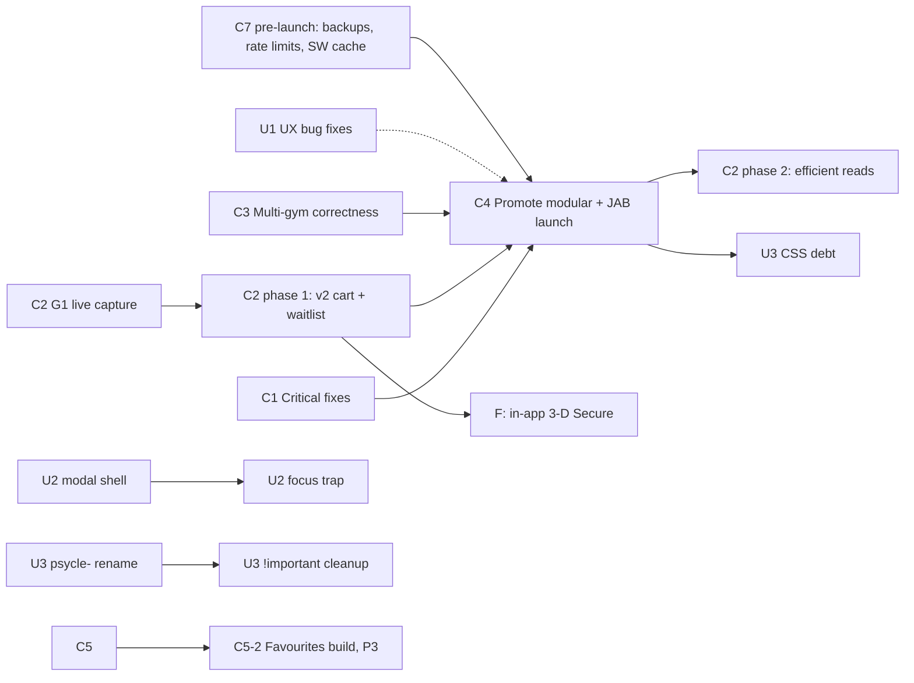

# Workstreams — Sweat Assistant roadmap

**This folder is the single source of truth for what's next.** It replaced `BACKLOG.md`,
`Backlog/*` and `Backlog/modular-gyms/*` on 2026-09-26. Those files are frozen in
[`../Archive/2026-09-26/`](../Archive/2026-09-26/). Their status markers are stale, but their
design detail is still valid, and items below link to it.

> **Before working any item, follow [AGENT_PROTOCOL.md](AGENT_PROTOCOL.md).** Verify the basis of
> the bug or change in the code **and in a real browser** before changing anything. Fail hard if
> no real browser is available. Use Gemini offload for reading and triage.

Every item was checked against the code at commit `5a16e9b` (2026-09-16, `modular` branch). No code
has changed since, so everything the 2026-09-23 live QA run and the 2026-09-26 API plan found is
still open.

## Where things stand

| | |
|---|---|
| **Prod** (`sweat.wingfield.tech`) | Old single-gym `master` build. Psycle only. **Buy Credits is broken here**: every v1 cart endpoint it calls is retired upstream. |
| **Dev twin** (`sweat-dev.wingfield.tech`) | `modular` branch: multi-gym (Psycle/CodexFit + JAB/MarianaTek), merged timetable, per-account calendar, restructured Settings. JAB is enabled there by env var. |
| **The milestone** | Promote `modular` to prod, then enable JAB for real users (**C4**). Most of the work below either blocks that or can wait until after it. |

## Workstreams

### Core functionality

| ID | Workstream | Priority | Size |
|---|---|---|---|
| [C1](C1-critical-fixes.md) | Critical fixes: security, session, data safety. **C1-1 to C1-4 done 2026-09-26; C1-5 and dev-twin deploy unaddressed** | **P0** | ~1 day |
| [C2](C2-psycle-api-v2.md) | Psycle API v2 compliance and efficiency | **P0** (phase 1), P1 (phase 2) | ~4–5 days |
| [C3](C3-multi-gym-correctness.md) | Multi-gym correctness | P1 | ~3 days |
| [C4](C4-live-acceptance-and-launch.md) | Live acceptance, promote to prod, JAB launch | **P0 milestone** | ~3 days of work over ~1–2 weeks elapsed |
| [C5](C5-auto-book.md) | Auto-book gaps; Favourites build (P3) | P2 (Favourites P3) | ~2.5 days |
| [C6](C6-accounts-auth.md) | Accounts and auth | P2 | ~2–3 days |
| [C7](C7-platform-ops.md) | Platform, ops and security hardening | P1 (pre-launch subset), P2–P3 (rest) | ~1 day pre-launch, then ~1 week |

### UX / design

| ID | Workstream | Priority | Size |
|---|---|---|---|
| [U1](U1-ux-bug-fixes.md) | UX bug fixes from QA | P1–P2 | ~1 day |
| [U2](U2-components-accessibility.md) | Shared components and accessibility | P2 | ~2–3 days |
| [U4](U4-ux-improvements.md) | UX improvements (user list 2026-09-29): mobile bookings, loading chips, rubber-band scroll, ∞ badge, progressive timetable load | P2 | ~4–5 days |
| [U3](U3-css-design-debt.md) | CSS and design-system debt | P3 | ~1 week |

### Later

| ID | Workstream | Priority |
|---|---|---|
| [F](F-future-features.md) | Future features: in-app 3-D Secure, guest passes, social sharing, MCP server, Postgres | P2–P3 |

## Recommended order

1. **C1 Critical fixes.** Small and independent. It closes a credential-leak surface and a
   bug where one gym's expired token logs you out of the whole app.
2. **C2 phase 0–1 (API capture, then v2 cart and waitlist verb).** Buy Credits is broken in prod
   today. Needs a live traffic capture first (gate G1).
3. **C3 Multi-gym correctness, with U1 alongside.** The bugs the 2026-09-23 live run found. U1
   is cheap copy/UI fixes that share the same test pass.
4. **C7 pre-launch subset.** SQLite backups, read-route rate limits, build-stamped service
   worker cache.
5. **C4 Live acceptance, then promote `modular` to prod, then enable JAB.** Includes re-running the
   Psycle regression suite on the new cart code.
6. **C2 phase 2 (efficient reads).** `/events` v2, `/heartbeat` cache invalidation, `/profile`
   dedupe. Deliberately after launch so the upstream traffic shape changes in a separate deploy.
7. **C5 Auto-book gaps** (Favourites build last, P3), then **C6 Accounts and auth**.
8. **U2 Components and accessibility**, then **U3 CSS debt.** U3 waits until after launch because it
   touches every screen and would invalidate acceptance screenshots.
9. **F Future features**, plus the rest of C7.

Added 2026-09-29: **U4** UX improvements (after the current U1 batch, before U3), **U1-11..U1-16** (current to-do), **F-7** gym config editor, **F-8** MarianaTek profile explorer, and **F-9** Gemini-powered booking/checking assistant.

Added 2026-09-27: **U2-5** (implement `TIMETABLE_FILTER_DESIGN_BRIEF.md`, after C4) and
**U3-6** (sweep for leftover "Psycle" references in gym-agnostic code, done with U3-1).

## Dependency map

Hard dependencies are solid arrows. U1 → C4 is dotted: nice to have, not blocking.

## Decisions

| Date | Decision |
|---|---|
| 2026-09-26 | **No prod (`master`) fix for Buy Credits.** C2 targets `modular` only. Prod in-app checkout stays broken until C4 ships `modular`. |
| 2026-09-26 | **Auto-Book Favourites will be built, at low priority** (C5-2, P3). Until then the UI stays hidden, as it is now. |
| 2026-09-26 | **Self-service account recovery uses an emailed single-use reset link** (C6-1). Needs a mail sender, which C6-2 email-change verification reuses. |

## Verified done: dropped from the backlog

These were still listed as open in the old docs. The code shows them done.

- Brand colour token: tokenised for light and dark themes, and matches `gyms.config.js`.
- Instructor thumbnails in timetable rows; gym logos and per-gym `[data-gym]` visual cues.
- Timetable paints from cache immediately on manual refresh; skeleton loaders on all tabs.
- No false "ineligible" flash while eligibility loads (`getIneligibleReason` is permissive until loaded).
- Reformer and other map studios keep "Book (choose a spot)" in the overflow menu.
- Poller booking-window tip is per-gym and provider-correct for non-CodexFit gyms.
- MarianaTek metadata catalog (`/api/metadata`) is provider-backed.
- `last_authenticated_at` is written on session issue (QA-07).
- Multi-gym Credits & Membership selector (live acceptance still sits under C4).
- `/api/proxy` deleted; account-level calendar feed; Settings restructure; filter grouping by gym;
  toast `aria-live`; QA-02 and QA-03.

## How to use this folder

- Change status **here only**: tick the item or add a dated note. Don't revive the archived files.
- New work goes into the matching workstream. For a large design, write a spec file in this folder
  and link it from the item.
- Item IDs (`C3-4`, `U1-2`) are stable. Reference them in commits and code comments.
- The old item IDs (QA-nn, WP-xx, Dn, Qn) are kept in brackets so the archive and QA logs can be
  traced.
