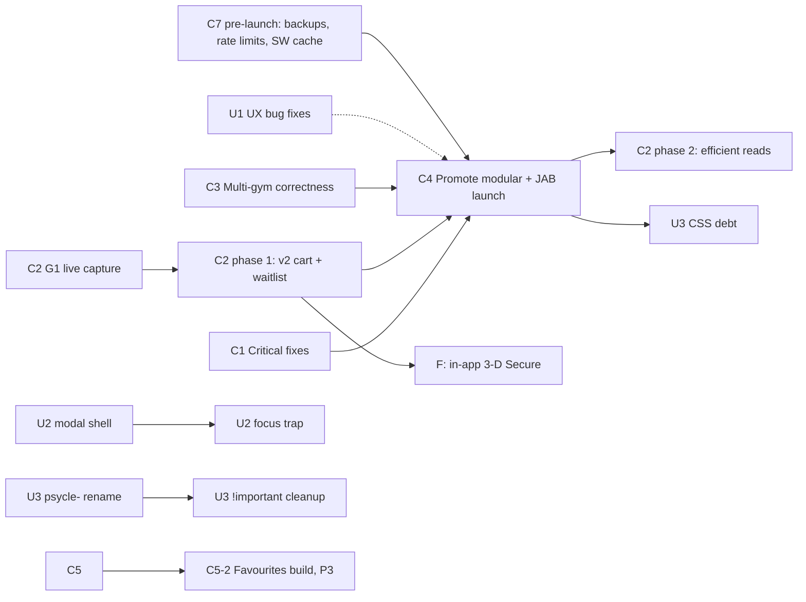

# Workstreams — Sweat Assistant roadmap

> **Branching (2026-10-07):** `master` is the only branch (the former `modular` and `optimisation` branches are merged and retired; older docs saying "`modular`" mean this code). It is pushed to GitHub at `8645425`, and `origin/optimisation` has been deleted. The Home page work lives on a separate branch, `codex/home-screen`, in another agent's worktree; it is not on `master`.

**This folder is the single source of truth for what's next.** It replaced `BACKLOG.md`,
`Backlog/*` and `Backlog/modular-gyms/*` on 2026-09-26. Those files are frozen in
[`../Archive/2026-09-26/`](../Archive/2026-09-26/). Their status markers are stale, but their
design detail is still valid, and items below link to it.

> **Before working any item, follow [AGENT_PROTOCOL.md](AGENT_PROTOCOL.md).** Verify the basis of
> the bug or change in the code **and in a real browser** before changing anything. Fail hard if
> no real browser is available. Use Gemini offload for reading and triage.

Status last tidied **2026-10-07**, after the `optimisation` branch and F-12 (gym-neutral favourites) landed on `master`. **Finished workstreams are moved to
[`../Archive/2026-10-06/`](../Archive/2026-10-06/)** (C1, C3, U1). Each remaining doc opens with a
dated STATUS line; open items are the only thing left to do.

## Where things stand

| | |
|---|---|
| **Prod** (`sweat.wingfield.tech`) | Multi-gym build (Psycle + JAB + Aarmy enabled, fresh DB), deployed by the user 2026-10-06. **Which commit prod runs is not recorded: verify before relying on it.** Buy Credits works (v2 cart). First account sign-up and `/admin` access remain user steps. |
| **Dev twin** (`sweat-dev.wingfield.tech`) | Deployed at `8645425` (current `master`). `METRICS_TOKEN` is unset there, so `/metrics` works only with an admin JWT. |
| **`master`** | Single working branch, pushed to GitHub at `8645425`. Includes the former `optimisation` work (C2-4, C2-5, C7-3, C7-4, MarianaTek speedup) and F-12. |
| **Home page (H)** | Not on `master`. On branch `codex/home-screen`: H-2 (welcome and name capture), H-3 (book row), H-5 (credits widget) in `1de2b97`, plus H-4 (upcoming classes), H-6 (favourites) and H-7 (top instructors) widgets committed since. Other agent's worktree; do not touch from here. |
| **Housekeeping open** | Set `METRICS_TOKEN` on dev; verify which commit prod runs. |

> **Shipped since launch (2026-10-06/07):** C2-4 (7-day-chunked ranged v2 `/events`; unscoped ranges 502 from ~14 days live) and C2-5 (heartbeat-stamp-gated cache refresh; occupancy can lag up to 5 min) are done, with the MarianaTek cold-load speedup, the `Vary: x-gym-id` HTTP-cache fix and the pending-gym loading skeleton. C7-3 (audit log, JSON logging, `/metrics`), C7-4 (instructor image proxy), C10 (Aarmy acceptance), C6-3 (won't do, no legacy accounts), U5 (archived), F-2 (guest bookings: Psycle allows several bookings of one class; JAB books, then books a guest in a separate modal) and F-12 (gym-neutral favourites, hearts and filter restored, Settings > Favourites pane grouped by weekday) are done. Open: prewarm (first data still ~15 s, one slow upstream).

## Workstreams

### Core functionality

| ID | Workstream | Priority | Size |
|---|---|---|---|
| C1 (archived) | ✅ **FINISHED, archived 2026-10-06** — [Archive/2026-10-06/C1-critical-fixes.md](../Archive/2026-10-06/C1-critical-fixes.md). Critical fixes: security, session, data safety. | P0 | done |
| [C2](C2-psycle-api-v2.md) | Psycle API v2 compliance and efficiency. Phase 1 and phase 2 done and on `master` (C2-4 7-day-chunked ranged `/events`, C2-5 heartbeat-stamp-gated cache refresh, C2-6 `/profile` dedupe, MarianaTek cold-load speedup); open: prewarm | P0 (phase 1), P1 (phase 2) | done bar prewarm |
| C3 (archived) | ✅ **FINISHED, archived 2026-10-06** — [Archive/2026-10-06/C3-multi-gym-correctness.md](../Archive/2026-10-06/C3-multi-gym-correctness.md). Multi-gym correctness; the last hunt candidate (failed fetch wiping reminder cache) fixed 2026-10-06. | P1 | done |
| [C4](C4-live-acceptance-and-launch.md) | Live acceptance, promote to prod, JAB launch (launched 2026-10-06) | P0 milestone, done | ~3 days of work over ~1–2 weeks elapsed |
| [C5](C5-auto-book.md) | Auto-book gaps; C5-2 (Auto-Book Favourites build) is now unblocked by F-12 and is next | P2 (C5-2 P3) | ~2.5 days |
| [C6](C6-accounts-auth.md) | Accounts and auth: C6-3 (legacy accounts) won't do; C6-1 (emailed reset link) and C6-2 (change email) open, not urgent with no real users yet | P2 | ~2–3 days |
| [C7](C7-platform-ops.md) | Platform, ops and security hardening (C7-3 logging/audit/`/metrics` and C7-4 image proxy done; C7-5 per-user AES keys deprioritised, consider dropping: it covers stored gym passwords only and does not change admin visibility; C7-6 Postgres, C7-7 occupancy-warming poller and C7-9 later rename of legacy psycle-named Access apps/edge/docker names open, P3) | P1 (pre-launch subset), P2–P3 (rest) | ~1 day pre-launch, then ~1 week |
| [C8](C8-admin-panel-and-insights.md) | Admin panel, fleet intelligence, attendance & ops; C8-1 (admin event ledger and booking lifecycle) is a confirmed real need and the first to do | P2 | ~1.5–2 weeks |
| [C9](C9-gym-onboarding.md) | Gym onboarding: provider reuse, tenant evidence and activation gates | P1 | Ongoing playbook |
| [C10](C10-aarmy-integration-acceptance.md) | Aarmy integration acceptance | P0 | Done per user 2026-10-06 (Aarmy enabled in prod; write paths waived, first real booking is the test) |

### UX / design

| ID | Workstream | Priority | Size |
|---|---|---|---|
| U1 (archived) | ✅ **FINISHED, archived 2026-10-06** — [Archive/2026-10-06/U1-ux-bug-fixes.md](../Archive/2026-10-06/U1-ux-bug-fixes.md) | P1–P2 | done |
| [U2](U2-components-accessibility.md) | Shared components and accessibility (U2-1, U2-2, U2-3, U2-5..U2-7 done; **U2-4, one shared helper for the hand-rolled empty states, open**) | P2 | ~2 days |
| [U4](U4-ux-improvements.md) | UX improvements: done: U4-1..5, U4-7..9, U4-11, U4-12 (accepted), U4-13, U4-14 (closed, logo dropped), U4-15, U4-16, U4-17, U4-18, U4-2, U4-19 (URL routing phases 1-8); U4-6 evaluated; **open: U4-10 (more glass)** | P2 | ~1–2 days (glass) |
| U5 (archived) | ✅ **FINISHED, archived 2026-10-06** — [Archive/2026-10-06/U5-modal-fullscreen-and-spot-flow.md](../Archive/2026-10-06/U5-modal-fullscreen-and-spot-flow.md). Mobile full-screen pages and spot-map booking flow. | P2 | done |
| [U3](U3-css-design-debt.md) | CSS and design-system debt | P3 | ~1 week |

### Later

| ID | Workstream | Priority |
|---|---|---|
| [H](H-home-page.md) | Home page of widgets (formerly F-10): H-0 history pull and H-1 shell done on `master`; H-2..H-7 committed on `codex/home-screen`, not merged. Also carries F-11 (class counts and stats) | P2 | ~2 weeks |
| [F](F-future-features.md) | Future features: in-app 3-D Secure, social sharing, MCP server, Postgres, and the rest (F-2 guest bookings and F-12 favourites are done; F-11 stats lives in H) | P2–P3 |

### Session logs

| Doc | State |
|---|---|
| [5-10-enhancements.md](5-10-enhancements.md) | Merged into `master` 2026-10-06 (U4-19 URL routing included); open: renderer merge, search-incremental rendering |

## Recommended order

Launched 2026-10-06; the pre-launch sequence is history. Post-launch order:

1. **C5-2 Auto-Book Favourites build.** Unblocked by F-12 (gym-neutral favourites).
2. **C8-1 admin event ledger** (a confirmed real need), then the rest of C8.
3. **C6-1 emailed reset link and C6-2 change email.** Not urgent while there are no real users.
4. **U2-4 shared empty-state helper**, then **U3 CSS debt** (touches every screen), and **U4-10 more glass**.
5. **C7-6 Postgres, C7-7 occupancy-warming poller and C7-9 (rename legacy psycle-named Access apps/edge/docker names, only if ever needed)** (P3); C7-5 per-user AES keys is deprioritised, consider dropping.
6. **F future features.** F-11 (class stats) is built inside the Home page workstream H, not separately.
7. **H Home page.** Being built on `codex/home-screen`; merge to `master` when that agent finishes.

C9 remains the standard onboarding path for future gym tenants.

Added 2026-09-29: **U4** UX improvements (after the current U1 batch, before U3), **U1-11..U1-16** (current to-do), **F-7** gym config editor, **F-8** MarianaTek profile explorer, **F-9** Gemini-powered booking/checking assistant, **F-10** Home/Dashboard page (now its own workstream, [H](H-home-page.md)), **F-11** class counts/stats/insights, **F-12** gym-neutral favourites, **F-13** calendar/weekly view of bookings, **F-14** SoulCycle gym integration, and **F-15** instructor photo proxy and cache. Added 2026-10-05: **F-16** admin-panel gym onboarding and editing (audit of per-gym config first). **F-17** instructor-change notification for any booked class, detected in the existing booking poll (spec only; see [F-future-features.md](F-future-features.md)). Added 2026-10-05: **U5** mobile full-screen pages and spot-map booking flow (progress, open items, new feedback).

Added 2026-09-27: **U2-5** (implement `TIMETABLE_FILTER_DESIGN_BRIEF.md`, after C4) and
**U3-6** (sweep for leftover "Psycle" references in gym-agnostic code, done with U3-1).

## Dependency map

Hard dependencies are solid arrows. U1 → C4 is dotted: nice to have, not blocking.

## Decisions

| Date | Decision |
|---|---|
| 2026-09-26 | **No prod (`master`) fix for Buy Credits.** C2 targets `modular` only. Prod in-app checkout stays broken until C4 ships `modular`. |
| 2026-09-26 | **Auto-Book Favourites will be built, at low priority** (C5-2, P3). Until then the UI stays hidden, as it is now. Unblocked by F-12 on 2026-10-06. |
| 2026-09-26 | **Self-service account recovery uses an emailed single-use reset link** (C6-1). Needs a mail sender, which C6-2 email-change verification reuses. |

## Verified done: dropped from the backlog

These were still listed as open in the old docs. The code shows them done.

- Brand colour token: tokenised for light and dark themes, and matches `gyms.config.js`.
- Instructor thumbnails in timetable rows; gym logos and per-gym `[data-gym]` visual cues.
- Timetable paints from cache immediately on manual refresh; skeleton loaders on all tabs.
- No false "ineligible" flash while eligibility loads (`getIneligibleReason` is permissive until loaded).
- Reformer and other map studios keep "Book (choose a spot)" in the overflow menu.
- Poller booking-window tip is per-gym and provider-correct for non-CodexFit gyms.
- MarianaTek metadata catalog (`/api/metadata`) is provider-backed.
- `last_authenticated_at` is written on session issue (QA-07).
- Multi-gym Credits & Membership selector (live acceptance still sits under C4).
- `/api/proxy` deleted; account-level calendar feed; Settings restructure; filter grouping by gym;
  toast `aria-live`; QA-02 and QA-03.

## How to use this folder

- Gym integration material: [C9 — Gym onboarding](C9-gym-onboarding.md) is the authoritative
  reusable process and evidence record. [C10 — Aarmy integration acceptance](C10-aarmy-integration-acceptance.md)
  holds its P0 tenant-specific steps and does not authorise activation or deployment.

- Change status **here only**: tick the item or add a dated note. Don't revive the archived files.
- New work goes into the matching workstream. For a large design, write a spec file in this folder
  and link it from the item.
- Item IDs (`C3-4`, `U1-2`) are stable. Reference them in commits and code comments.
- The old item IDs (QA-nn, WP-xx, Dn, Qn) are kept in brackets so the archive and QA logs can be
  traced.

**Update 2026-10-07:** user-confirmed: **F-2** (guest bookings) is done, nothing open; **F-11** (class counts and stats) is built inside the Home page workstream ([H](H-home-page.md)); **C8-1** (admin event ledger and booking lifecycle) is a genuine job to be done and stays open. **F-12** (gym-neutral favourites) is done and on `master` (see [F-future-features.md](F-future-features.md)).
